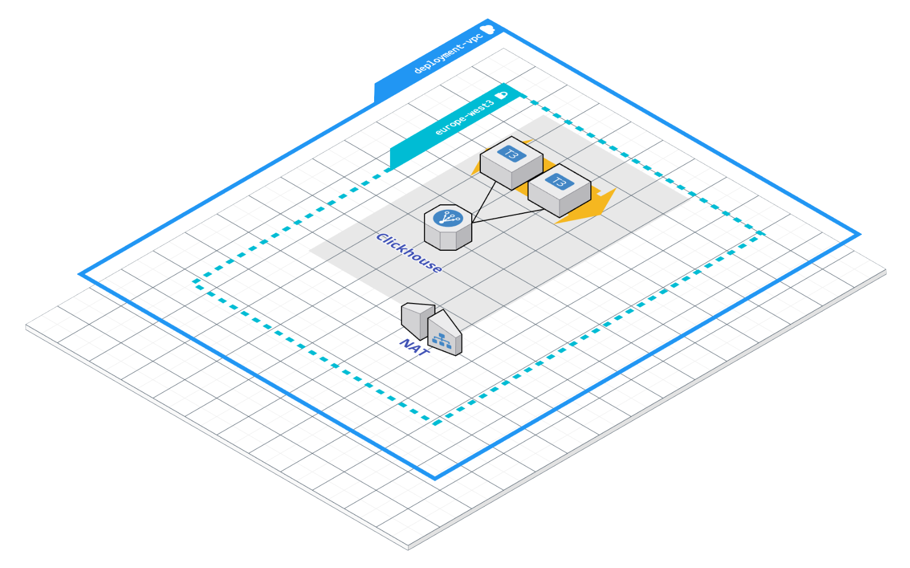

# Open Targets Platform Elastic Search Data Backend
This submodule defines the infrastructure needed to deploy a Clickhouse based data backend, within the context of Open Targets Platform.



The picture above these lines represents a deployment unit of Open Targets Platform Clickhouse data backend.

VM instances running the Clickhouse services are configured in a regional instance group, deployed in the given region, behind an internal load balancer.

# How to use the module
The module can be sourced from its GitHub URL as shown below.
```terraform
// --- Elastic Search Backend --- //
module "backend_elastic_search" {
  source = "github.com/opentargets/terraform-google-opentargets-platform//modules/clickhouse"
  // ...
}
```

# Module configuration
The module implements the following input parameters.