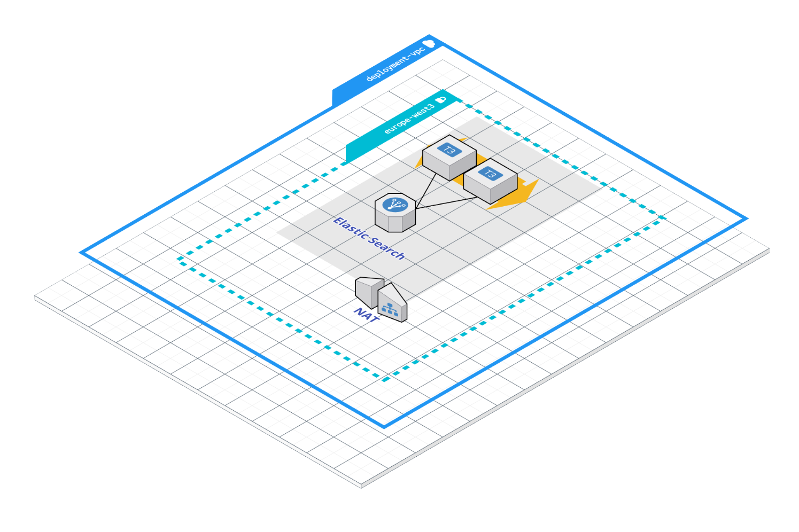

# Open Targets Platform Elastic Search Data Backend
This submodule defines the infrastructure needed to deploy an Elastic Search based data backend, within the context of Open Targets Platform.



The picture above these lines represents a deployment unit of Open Targets Platform Elastic Search data backend.

VM instances running the Elastic Search services are configured in a regional instance group, deployed in the given region, behind an internal load balancer.

# How to use the module
The module can be sourced from its GitHub URL as shown below.
```terraform
// --- Elastic Search Backend --- //
module "backend_elastic_search" {
  source = "github.com/opentargets/terraform-google-opentargets-platform//modules/elasticsearch"
  // ...
}
```

# Module configuration
The module implements the following input parameters.

## General Deployment Information
>**module_wide_prefix_scope**, the prefix provided here will scope names for those resources created by this module, default 'otpdeves'.

>**network_name**, name of the network where resources should be deployed, 'default'.

>**network_self_link**, self link to the network where resources should be connected when deployed.

>**network_subnet_name**, name of the subnet, within the 'network_name', and the given region, where instances should be connected to.

>**network_source_ranges**, CIDR that represents which IPs we want to grant access to the deployed resources, default '10.0.0.0/9'.

>**network_sources_health_checks**, source CIDR for health checks, default '[ 130.211.0.0/22, 35.191.0.0/16 ]', which is the CIDRs used by Google Cloud Infrastructure.

>**deployment_region**, region where resources should be deployed.

## Elastic Search Instance configuration
>**deployment_target_size**, initial Elastic Search node count to deploy, default is '1'.

>**vm_firewall_tags**, additional tags that should be attached to any Elastic Search Node deployed by this module.

>**vm_elastic_search_version**, elastic Search Docker Image version to use.

>**vm_elastic_search_vcpus**, CPU count for each Elastic Search Node VM.

>**vm_elastic_search_mem**, amount of memory assigned to every Elastic Search Instance (MiB).

>**vm_elastic_search_image**, VM Image to use for Elastic Search instances.

>**vm_elastic_search_image_project**, ID of hosting project for the Elastic Search VM Instance image.

>**vm_elastic_search_boot_disk_size**, Elastic Search instances boot disk size, default '500GB'

# Output Information
Once the infrastructure has been successfully deployed, the following details are revealed by this module as output.

>**deployment_region**, region where resources have been deployed.

>**network_name**, VPC network where resources have been connected to.

>**network_subnet_name**, VPC Subnet within the given region where resources have been connected to.

>**ilb_ip_address**, IP address of the deployed Internal Load Balancer that is at front of the Elastic Search VMs.

>**port_elastic_search_requests**, Elastic Search Request port.

>**port_elastic_search_requests_name**, named port corresponding to Elastic Search Request port.

>**port_elastic_search_comms**, Elastic Search inter-node communications port.

>**port_elastic_search_comms_name**, named port corresponding to Elastic Search inter-node communications port.


#### Disclaimer
Infrastructure visual diagrams use AWS icons and visual elements, but their meaning in Open Targets Google Cloud Infrastructure is the same, from the conceptual point of view.

# Copyright
Copyright 2014-2018 Biogen, Celgene Corporation, EMBL - European Bioinformatics Institute, GlaxoSmithKline and Wellcome Sanger Institute

This software was developed as part of the Open Targets project. For more information please see: http://www.opentargets.org

Licensed under the Apache License, Version 2.0 (the "License");
you may not use this file except in compliance with the License.
You may obtain a copy of the License at

   http://www.apache.org/licenses/LICENSE-2.0

Unless required by applicable law or agreed to in writing, software
distributed under the License is distributed on an "AS IS" BASIS,
WITHOUT WARRANTIES OR CONDITIONS OF ANY KIND, either express or implied.
See the License for the specific language governing permissions and
limitations under the License.