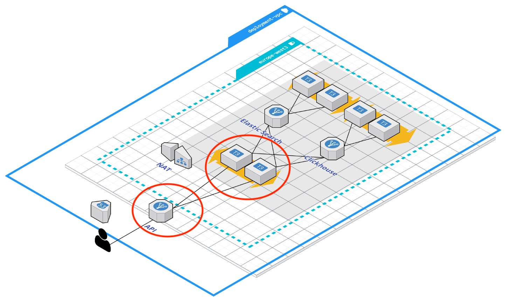

# Pending
- [ ] add tags to resources to further filter metrics. I need to check how to apply the tags to the vm not the template
- [ ] Change machine definition to match the ai definition
- [ ] Update the Prometheus configuration file with all possible zones for each region
- [ ] Generate and attach credentials file to Prometheus vm. Set env variable GOOGLE_APPLICATION_CREDENTIALS
- [ ] Update vm definition to not use manager
- [ ] Pre configure Grafana
- [ ] Update documentation
- [ ] Check JVM metrics and how to ignore the problematic ones
- [ ] Expose CH and ES metrics endpoint
- [ ] Update vm definitios to 
- [ ] make node exporter and other exporters variables with defaults so they can be configured

# Open Targets Platform API TODO: Update this documentation
This submodule defines the infrastructure needed to deploy Open Targets Platform API.



The picture above these lines represents the Open Targets Platform API elements defined by this infrastructure definition.

VM instances running the Open Targets Platform API services are configured in a regional instance group, deployed in the given regions, and tagged accordingly, with the option of having an internal load balancer or global load balancer at front, or none of them.

# How to use the module
The module can be sourced from its GitHub URL as shown below.
```terraform
// --- Open Targets Platform API --- //
module "backend_api" {
  source = "github.com/opentargets/terraform-google-opentargets-platform//modules/api"
  // ...
}
```

# Module configuration
The module implements the following input parameters.

## General configuration
>**module_wide_prefix_scope**, scoping prefix for resources names deployed by this module, default 'otpdevapi'.

>**project_id**, ID of the project where resources should be deployed.

>**network_name**, name of the network where resources should be connected to, default 'default'.

>**network_self_link**, self link to the network where resources should be connected when deployed.

>**network_subnet_name**, name of the subnet, within the 'network_name', and the given region, where instances should be connected to, default 'main-subnet'.

>**network_source_ranges_map**, CIDR that represents which IPs we want to grant access to the deployed resources.

>**network_sources_health_checks**, source CIDR for health checks, default '[ 130.211.0.0/22, 35.191.0.0/16 ]', which are the source CIDRs used by Google Cloud infrastructure.

## API instances configuration
>**deployment_regions**, list of regions where the API nodes should be deployed.

>**vm_firewall_tags**, list of additional tags to attach to API nodes.

>**vm_platform_api_image_version**, API Docker image version to use in deployment.

>**vm_api_vcpus**, CPU count for API nodes, default '2'.

>**vm_api_mem**, amount of memory allocated for API nodes (MiB), default '7680'.

>**vm_api_image**, VM image to use for API nodes, default 'debian-12-bookworm-v20250415'.

>**vm_api_image_project**, project hosting the VM image, default 'debian-cloud'.

>**vm_api_boot_disk_size**, boot disk size for API nodes, default '10GB'.

>**deployment_target_size**, initial API node count per region.


## Data Backend configuration
>**backend_connection_map**, information on where to connect to data backend services.


## Load Balancer configuration
>**load_balancer_type**, this will tell the module whether an internal load balancer, a global load balancer, or no load balancer at all should be created. Valid values are: 'INTERNAL', 'GLOBAL' (**UNDER REVIEW, DO NOT USE**), 'NONE'.

## DNS configuration
>**dns_domain_api**, domain name used for generation of managed SSL certificate to be configured in the load balancer. (**THIS OPTION IS UNDER REVIEW, DO NOT USE**)

# Output Information
Once the infrastructure has been successfully deployed, the following details are revealed by this module as output.

>**deployment_regions**, a list of regions where API nodes have been deployed.

>**map_region_to_instance_group_manager**, for every region, API nodes are deployed within a managed regional instance group, and this map provides a per region reference to every deployed instance group.

>**capacity_scalers**, a map between deployment regions and the defined capacity scalers in each region.

>**api_port**, Open Targets Platform API listening port.

>**api_port_name**, named port corresponding to Open Targets Platform API listening port

>**ilb_ip_addresses**, a map from region to the corresponding deployed internal load balancer, in case 'INTERNAL' was chosen as the load balancer option.

>**glb_external_ip**, external IP of the deployed global load balancer, in case 'GLOBAL' was chosen as the load balancer option.

#### Disclaimer
Infrastructure visual diagrams use AWS icons and visual elements, but their meaning in Open Targets Google Cloud Infrastructure is the same, from the conceptual point of view.

# Copyright
Copyright 2014-2018 Biogen, Celgene Corporation, EMBL - European Bioinformatics Institute, GlaxoSmithKline and Wellcome Sanger Institute

This software was developed as part of the Open Targets project. For more information please see: http://www.opentargets.org

Licensed under the Apache License, Version 2.0 (the "License");
you may not use this file except in compliance with the License.
You may obtain a copy of the License at

   http://www.apache.org/licenses/LICENSE-2.0

Unless required by applicable law or agreed to in writing, software
distributed under the License is distributed on an "AS IS" BASIS,
WITHOUT WARRANTIES OR CONDITIONS OF ANY KIND, either express or implied.
See the License for the specific language governing permissions and
limitations under the License.